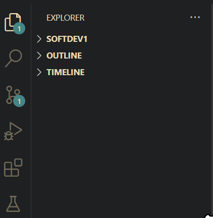

# 📦 Linter config file for SOFTDEV

✌️ Yo. I'd like to share my Ruff configuration file because I'm too lazy to manually find PEP 8 inconsistencies and in-house rules in my Python scripts. I also don't want to lose a mark because I forgot to place a single blank line lmao.  


The linter I'm using is **Ruff**, and it can be easily added as an extension in VS code.

- [📦 Linter config file for SOFTDEV](#-linter-config-file-for-softdev)
- [How to use in VS Code](#how-to-use-in-vs-code)
- [Class-specific rules](#class-specific-rules)
- [Ruff settings](#ruff-settings)
    - [Max line length](#max-line-length)
    - [Max comment and docstring length](#max-comment-and-docstring-length)
- [Linter rules in Ruff](#linter-rules-in-ruff)


# How to use in VS Code

1. Open Extensions. Search and install `Ruff`



2. Download or copy the contents of `pyproject.toml`
3. Create or place `pyproject.toml` in your Git repository
4. *Optional*: add `pyproject.toml` to your `.gitignore` file

🥳 Yay! You now have Ruff set up in your VS code


# Class-specific rules

In addition to PEP 8, SOFTDEV also has its own in-house rules that takes precedence over PEP8.

Here's a non-exhaustive list of our in-house rules:
- Maximum characters per line = 99
  - PEP 8 recommends 79, but in SOFTDEV it's increased to 99
- Docstring and comments are limited to 72 characters
- Use double-quotes for quoting strings
- Use of dunder variables `__author__` and `__version__` after module documentation
- Fuction documentation
  - Use docstring style documentation, and must contain the following sections when required: "Args", "Returns" and "Raises".
- *And more!* refer to the Course Development Standards doc.

# Ruff settings

### Max line length

```toml
[tool.ruff]
# Set maximum line length to 79
line-length = 79
indent-width = 4

```

Even though our in-house rules have increased the character limit to 99, I'd like to play safe and keep it at 79. Change this to 99 if you want to increase the line length.

### Max comment and docstring length
```toml
[tool.ruff.lint.pycodestyle]
max-doc-length = 72
```

I set it to 72

# Linter rules in Ruff
List of rules I added in the Ruff configuration file `pyproject.toml`. The first row is enabled by default, but I still wrote it in the configuration for clarity.

> [!CAUTION] 
> The rules I added below cover most of the PEP 8 standards and our in-house rules for SOFTDEV, but they do not address every single detail.  
> Please do not rely solely on this configuration file when adhering to PEP 8 or our in-house overrides

| Ruff Code         | Name                               | Description                                                            |
| ----------------- | ---------------------------------- | ---------------------------------------------------------------------- |
| E4, E7, E9, and F | Flake8 and some pycodestyle errors | This is **enabled by default** when you install Ruff.                      |
| W                 | pycodestyle warnings               | Checks for 'Doc line too long' and 'No newline at end of file'         |
| E501              | pycodestyle line-too-long          | Checks if your line exceeds the set character limit                    |
| D                 | pydocstyle                         | Contains the entire Python docstring convention. Supports most PEP 257 |
| Q                 | flake8-quotes                      | Prefer double quotes over single quotes                                |
| E262              | pycodestyle error                  | Checks for "No space after inline comment"                             |
| E265              | pycodestyle error                  | Checks for "No space after block comment"                              |
| E225              | pycodestyle error                  | Checks for missing whitespace around operator                          |
| E226              | pycodestyle error                  | Checks for missing whitespace around arithmetic operator               |
| E227              | pycodestyle error                  | Checks for missing whitespace around bitwise or shift operator         |
| E228              | pycodestyle error                  | Checks for missing whitespace around modulo operator                   |
| E231              | pycodestyle error                  | Checks for missing whitespace after `,`, `;`, and `:`                  |
| PLR2044           | Pylint refactor                    | Checks for an empty comment                                            |
| N                 | pep8-naming                        | Check for PEP 8 naming conventions                                     |